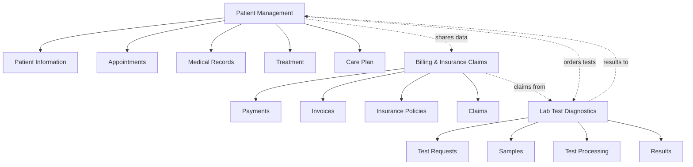

```mermaid
graph TD

    A[Patient Management] --> B[Patient Information]
    A --> C[Appointments]
    A --> D[Medical Records]
    A --> E[Treatment]
    A --> F[Care Plan]

    G[Billing & Insurance Claims] --> H[Payments]
    G --> I[Invoices]
    G --> J[Insurance Policies]
    G --> K[Claims]

    L[Lab Test Diagnostics] --> M[Test Requests]
    L --> N[Samples]
    L --> O[Test Processing]
    L --> P[Results]

    A -.->|shares data| G
    A -.->|orders tests| L
    L -.->|results to| A
    G -.->|claims from| L
```
